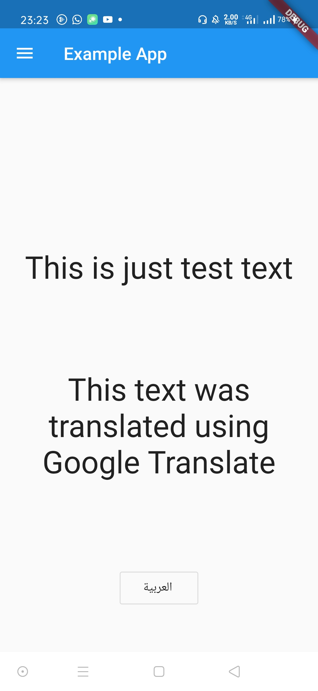
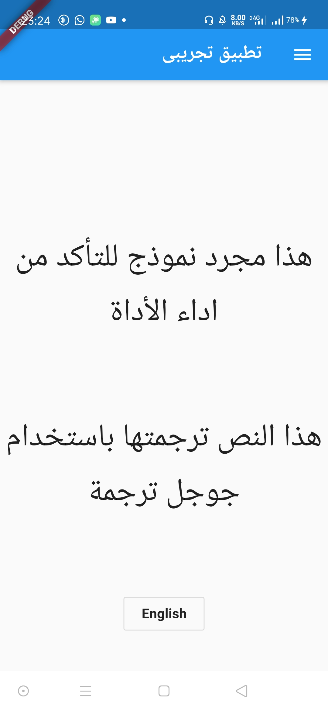

# localize_and_translate
localization and translation was never easier, simple way to translate your flutter apps and make it international


## Screenshots
<span>  </span>


## How To Use


## Methods
| Tables        | Are           |
| ------------- |:-------------:|
| `currentLanguage` | returns current Language |
| col 2 is      | centered      |
| zebra stripes | are neat      |
* `currentLanguage` : returns current Language
* `locale` : returns current Locale
* `locals()` : returns current Locales
* `translate(word)`  : returns word translation
* `init()` : initialize things, before runApp()
* `setNewLanguage('en')` : switch to another language


## Complete Example
```dart

```


## Author
[](https://msayed.net)
* [](https://github.com/MohamedSayed95/localize_and_translate/fork) &nbsp; [](https://github.com/MohamedSayed95/localize_and_translate/stargazers) &nbsp; [](https://github.com/MohamedSayed95/localize_and_translate/) 
* [](https://pub.dev/packages/localize_and_translate) &nbsp; [](https://pub.dev/packages/localize_and_translate#-example-tab-)

## My Plugins
* [localize_and_translate](https://pub.dev/packages/localize_and_translate)
* [user_auth](https://pub.dev/packages/user_auth)
* [print_color](https://pub.dev/packages/print_color)

